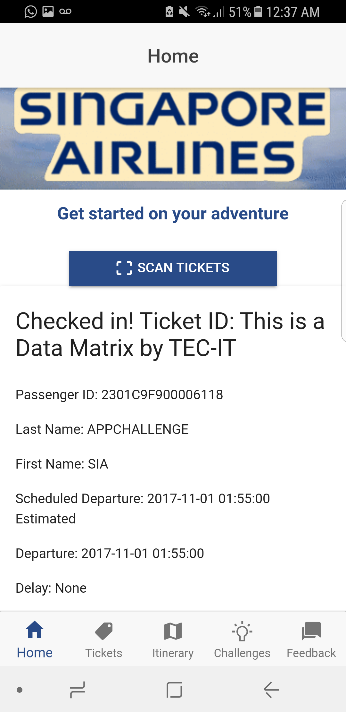
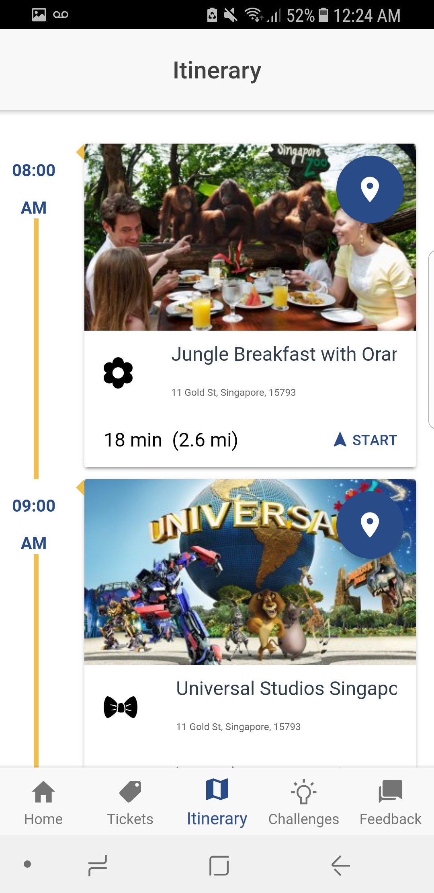
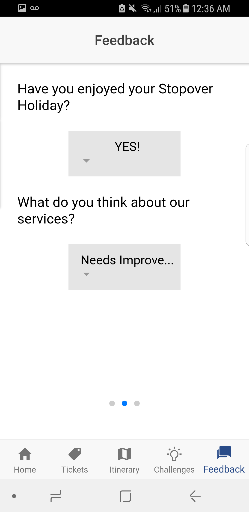
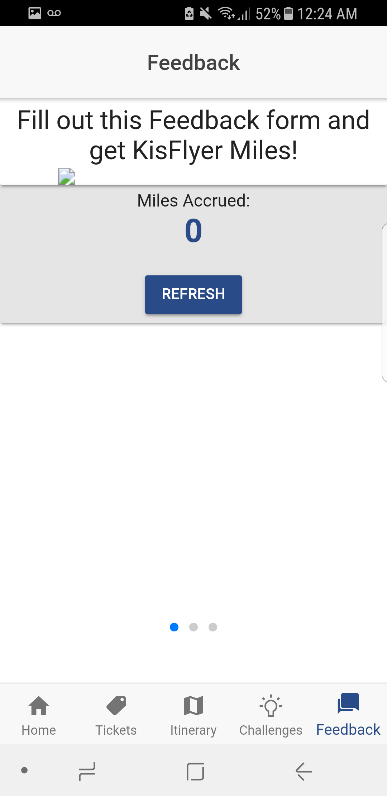

<h1> SQXP - Personalized Social App for Singapore Stopover Holidays </h1>

This hybrid mobile app is built by Ionic framework during Singapore International Airlines AppChallenge 2017. 
This app won the Open Category Grand Prizes for the preliminary round in San Francisco as well as for the final round in Singapore. 

## Summary

The mobile app serves 5 functions that makes the Singapore Stopover Holidays experience more enjoyable, personalized and social:
1. The user receives the digital welcome package by scanning his/her boarding pass. The user can also check the status for his/her next flight.

2. The mobile app assess the user's budget, interests and layover time to suggest activities during the Stopover Holiday for the user.

3. The mobile app autogenerates the itinerary or the schedule for the user and provides in-app naviation.

4. The mobile app provides location-based challenges and enables the users to share their experiences on the Instagram.

5. The user can provide feedback easily to Singapore International Airlines about his/her stopover holidays experience and gain KrisFlyer mileage.

